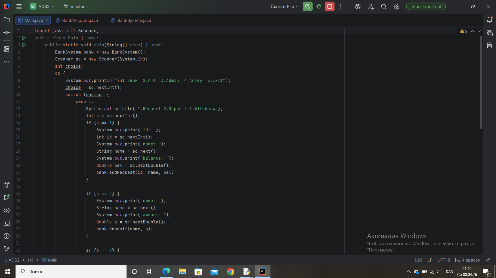
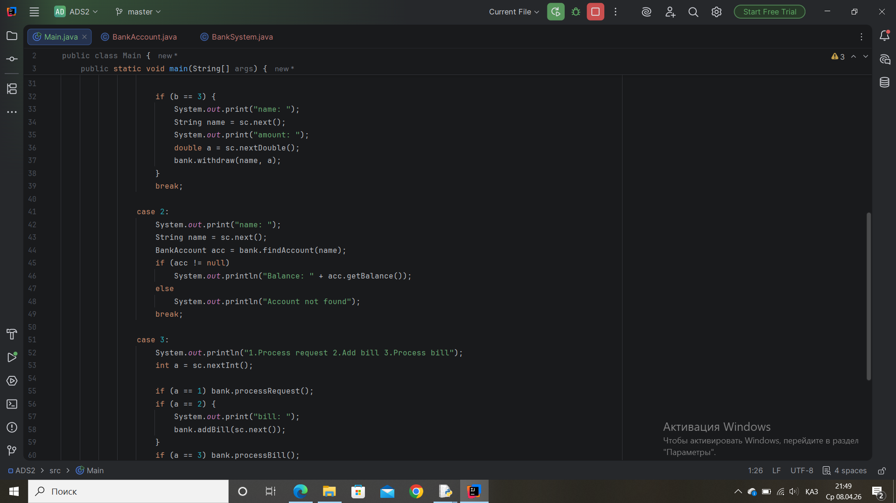
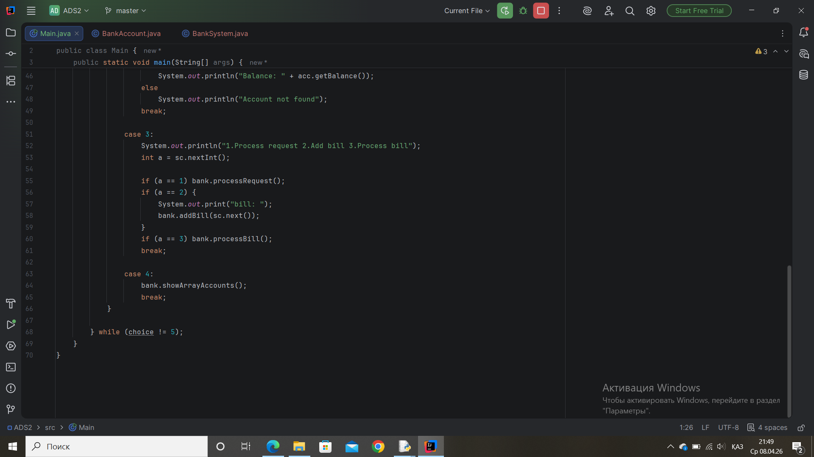
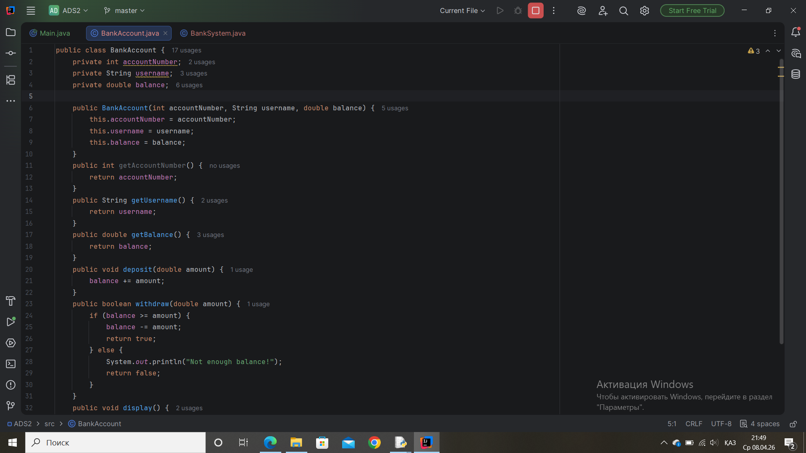
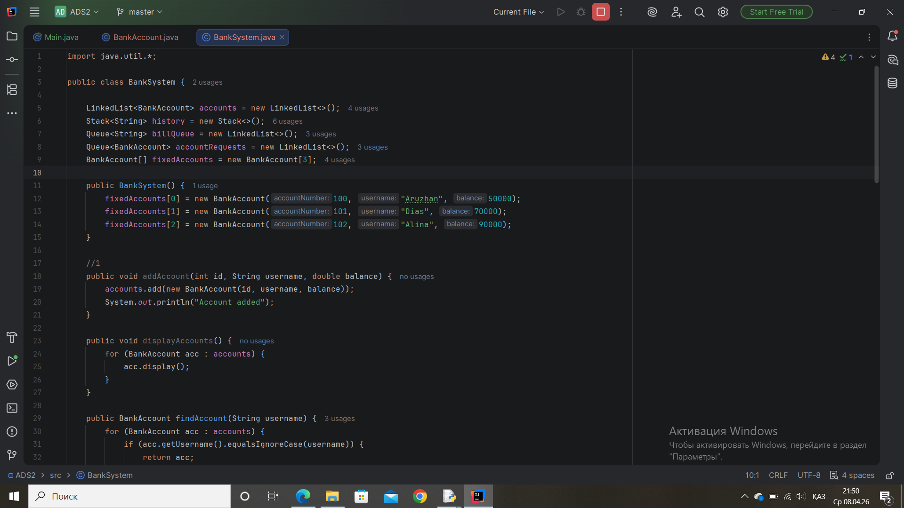
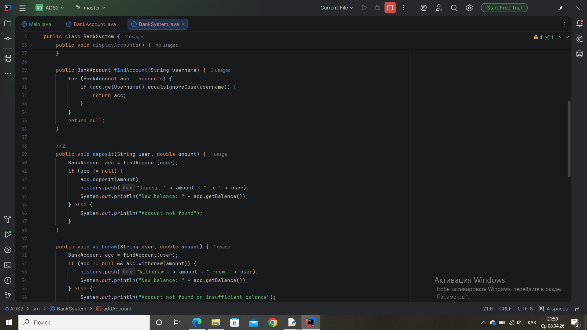
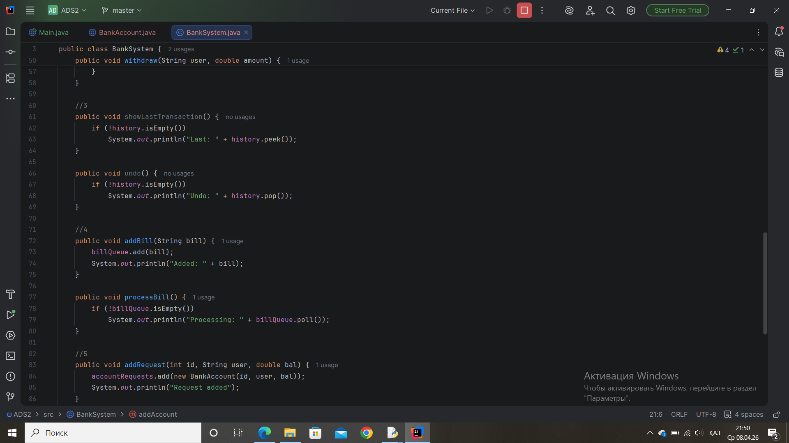
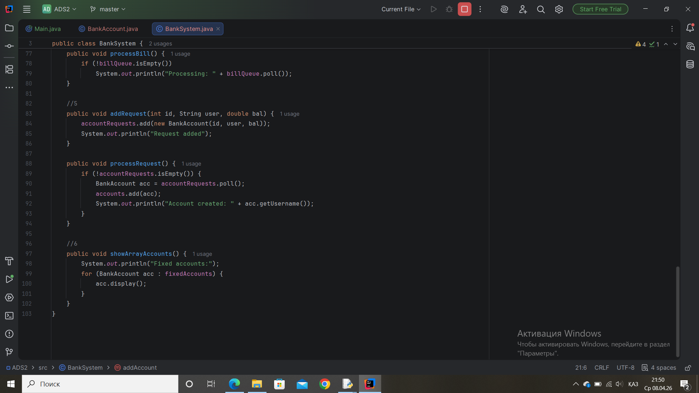
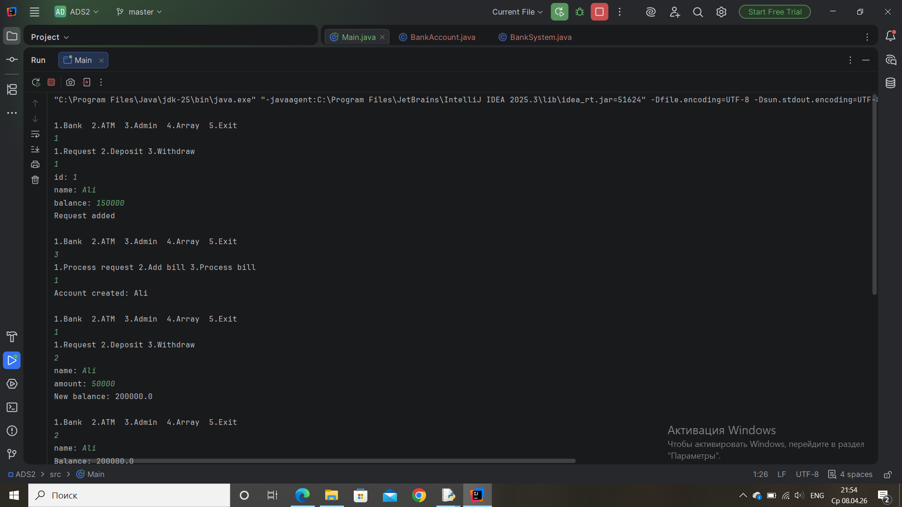
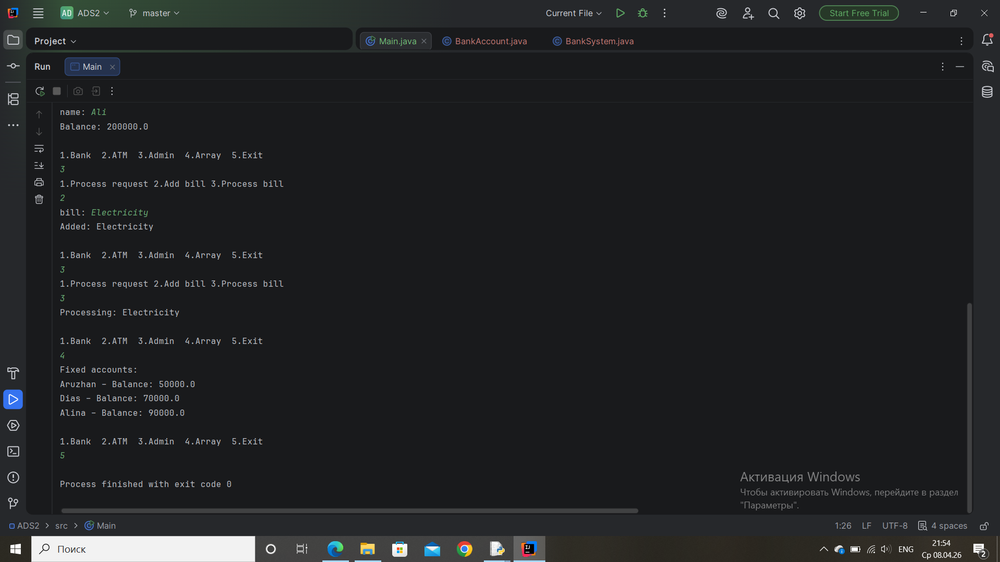

# ADS2 – Banking System

## Student:
Zhibek Akberdiyeva

## Group:
SE-2511

---

## Objective
The goal of this assignment is to understand and apply logical and physical data structures in Java, including LinkedList, Stack, Queue, and Array, and simulate real banking operations.

---

## Program Output Screenshots

Below are the screenshots demonstrating the program execution:

---

## Work Process
During this assignment, I wrote new code and became more familiar with Java programming. I practiced using different data structures such as LinkedList, Stack, Queue, and Array. While working on this project, I improved my understanding of how these structures operate and how they can be applied in real-world systems like banking.

---

## Conclusion
By completing this assignment, I understood Java much better. I gained a deeper understanding of logical data structures and how a banking system works in practice. This task helped me improve my coding skills and strengthened my overall understanding of programming concepts.
